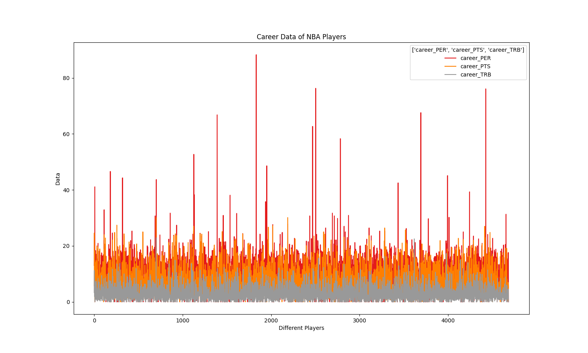
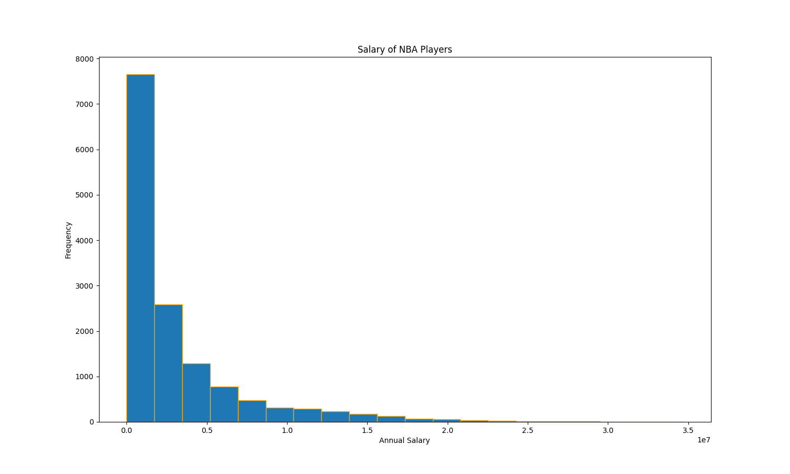
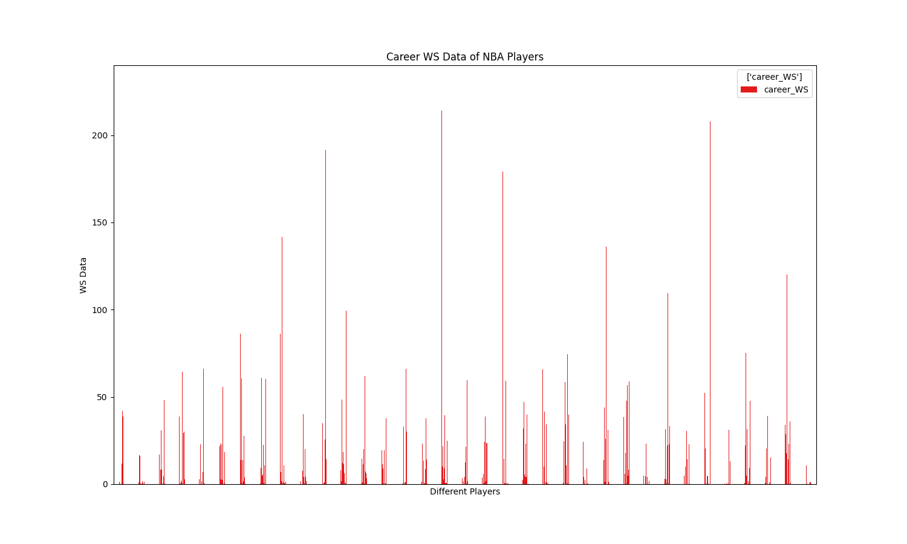

# Hongyi-Duan-Individual-Project-1

[](https://github.com/nogibjj/Hongyi-Duan-Individual-Project-1/actions/workflows/lint.yml)
[](https://github.com/nogibjj/Hongyi-Duan-Individual-Project-1/actions/workflows/install.yml)
[](https://github.com/nogibjj/Hongyi-Duan-Individual-Project-1/actions/workflows/format.yml)
[](https://github.com/nogibjj/Hongyi-Duan-Individual-Project-1/actions/workflows/test.yml)

# NBA Players Career and Salary Data Analysis

This project visualizes various career statistics and salary data of NBA players, using Python libraries such as `matplotlib` for data visualization.

## Table of Contents

- [Description](#description)
- [Visualizations](#visualizations)
- [Files](#files)
- [Requirements](#requirements)
- [How to Run](#how-to-run)
- [License](#license)

## Description

This project focuses on analyzing the career data of NBA players, including their performance and salaries. The data is visualized through line and bar charts to provide insights into player statistics such as Win Shares (WS), Points (PTS), Player Efficiency Rating (PER), Total Rebounds (TRB), and player salaries over their careers.

## Visualizations

### 1. **Career Data of NBA Players**


- This line chart showcases the career statistics of NBA players, including Player Efficiency Rating (PER), Points (PTS), and Total Rebounds (TRB) over time.

### 2. **Salary Distribution of NBA Players**


- A histogram that shows the distribution of salaries among NBA players.

### 3. **Career Win Shares (WS) of NBA Players**


- This line chart shows the distribution of Win Shares (WS) among NBA players over their careers.

## Files

- **`lib.py`**: Contains the main library functions used for the analysis.
- **`test_lib.py`**: Unit tests for the functions in `lib.py`.
- **`Career_Data_of_NBA_Players.png`**: A line chart of career data (PER, PTS, TRB) of NBA players.
- **`Career_Salary_of_NBA_Players.png`**: A histogram representing the salary distribution of NBA players.
- **`Career_WS_Data_of_NBA_Players.png`**: A line chart showing career Win Shares (WS) data of NBA players.

## Requirements

Make sure you have the following Python libraries installed:

```bash
pip install matplotlib pandas
```

Additionally, any other dependencies can be added as needed in a `requirements.txt` file.

## How to Run

1. Clone this repository.
2. Install the necessary requirements:

   ```bash
   pip install -r requirements.txt
   ```

3. Run the visualizations by executing the Python script:

   ```bash
   python lib.py
   ```

4. Run the tests to ensure that everything is working as expected:

   ```bash
   python -m pytest test_lib.py
   ```

## License

This project is licensed under the MIT License. See the [LICENSE](LICENSE) file for more details.
